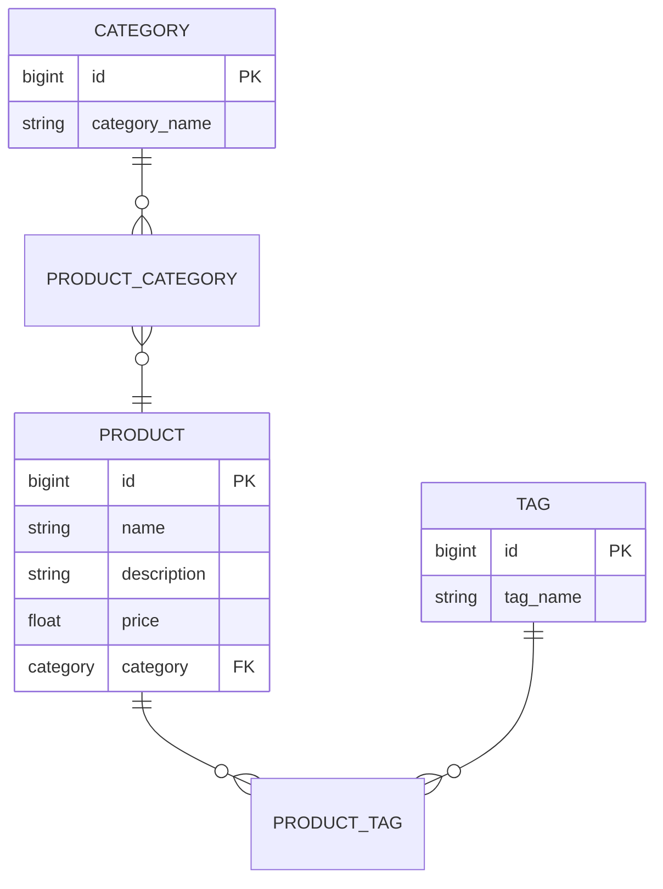

# remarcable-demo
Demo application created for Remarcable using Django

# Setup Instructions:
1. Clone the repository
2. Navigate to project directory and install dependencies using prefered package manager
	* for pip: ```pip install .```
4. Navigate to the main remarcable directory containaing manage.py
	* run: ```python manage.py runserver``` to start the development server

Assumptions:
- Each product can have multiple tags and multiple categories
- Product can be searched by both description and title fields


ER Diagram:


